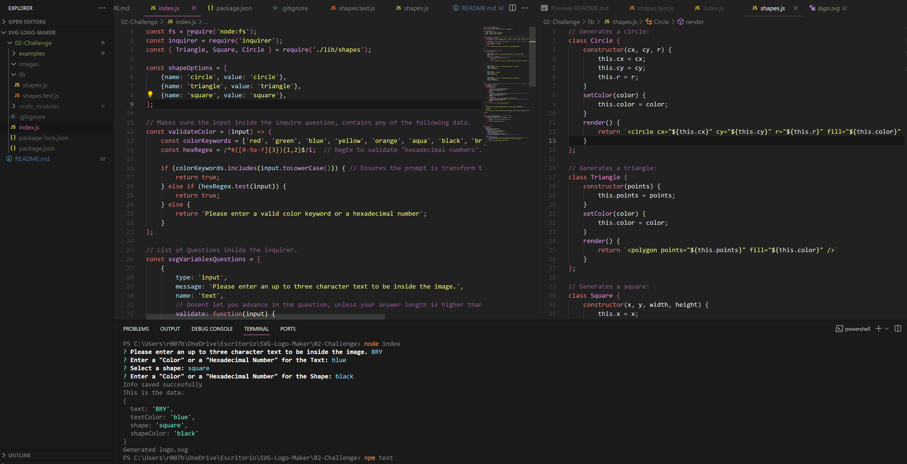

# SVG-Logo-Maker

## Description
A **'Node.js'** command-line application that takes in user input to generate a logo and save it as an SVG file. 

The application prompts the user to select a color and shape, provide text for the logo, and save the generated SVG to a .svg file.

This helps the user to create a personal logo without the need to hire a professional graphic designer.

### How to use it:
To use the application, you need to open the terminal and use the command "node index.js" or "node index", and answer each of the following questions given by *inquire*.

Once all the questions are answered, a new **'.SVG'** file will appear at the folder **'/examples'** , with the specified variables.

## Example image:

### Made by
Student : Bryan Gomez Cerda

Link to video/test : https://drive.google.com/file/d/1uS55m4ZUpcbmMtdunVI3uVC0b10dl4yn/view?usp=sharing 

Link to Repo :

